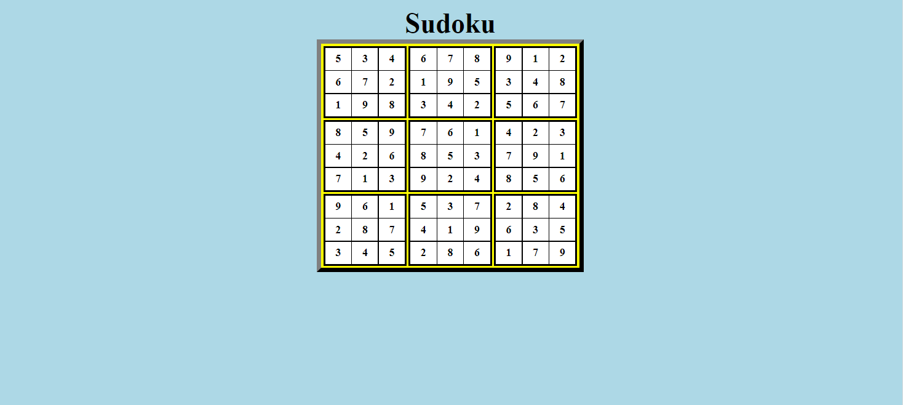

Bu klasör altında basic html-css kullanılarak yapılan Sudoku arayüzü ödevi bulunmaktadır.  
Bu hafta tamamlanan konu başlıkları:  
1-Background-color & Color  
2-Stillendirme Yöntemleri  
3-Margin  
4-Padding  
5-Tablolar  
6-Inputs  
7-Class  
8-Id  
9-Import  
10-Box Sizing  
11-Border Radius  
12-Font Family   
13-Font Size  
14-Font Style  
15-Text Align  
16-Text Decoration  
17-Flex  

