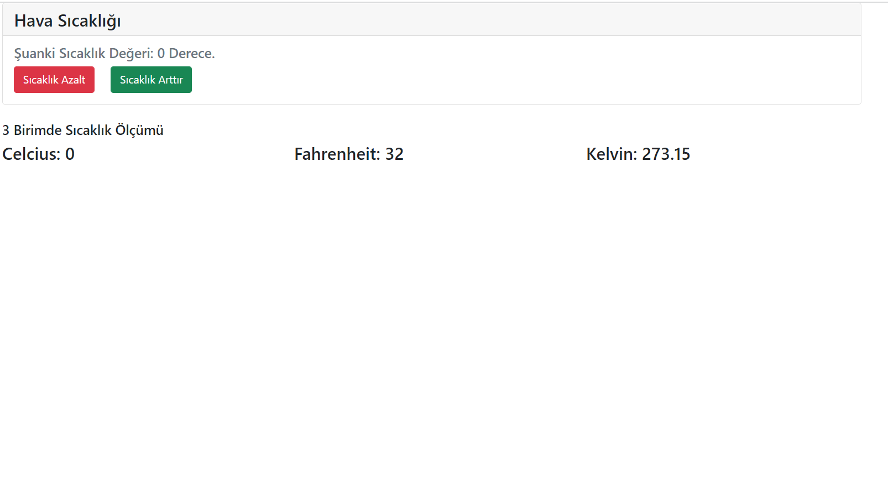

Bu klasör altında basic React.js kullanılarak yapılan Hava Durumu ödevi bulunmaktadır.
Bu hafta tamamlanan konu başlıkları:
1- Kurulumlar
2- create-react-app
3- Component Mimarisi
4- Reactstrap
5- Props
6- State

